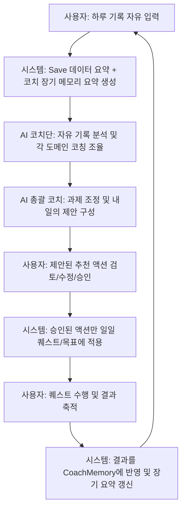

# AI 성장 코치 설계 문서 (AI Growth Coach Design)

본 문서는 LEVEL UP 게임화 자기관리 플랫폼에 탑재할 **AI 성장 코치(AI Growth Coach)** 시스템의 아키텍처, 데이터 흐름, 생성 원칙, 그리고 단계별 구현 계획을 정의합니다.

---

## 1. 목적 (Purpose)

LEVEL UP은 기존에 다채로운 게임 콘텐츠(Direct Battle, Shadow, Expedition, Equipment 등)를 통해 강력한 몰입감과 동기부여를 제공해 왔습니다. 그러나 사용자가 성장함에 따라 고정된 일일 퀘스트를 기계적으로 반복하게 되는 한계가 존재했습니다.

**AI 성장 코치**는 사용자의 실제 삶과 일치하는 맞춤형 관리 시스템을 구축하는 핵심 엔진입니다.
* **게임 시스템의 역할**: 캐릭터 성장, 보상 지급, 전투, 탐험 등을 통한 **동기부여/몰입/재미 제공**.
* **AI 성장 코치의 역할**: 사용자의 비정형 생활 기록 분석, 피로도 및 성취도를 고려한 **다음 날 과제 처방**, 장기 성장을 유도하기 위한 **목표 및 던전 조정**.

---

## 2. 핵심 루프 (Core Loop)

사용자와 시스템 간의 일일 상호작용 및 데이터 흐름은 다음과 같은 선순환 구조로 작동합니다.



1. **자유기록 입력**: 사용자는 하루의 성과, 건강, 기분 등을 가볍게 기록합니다.
2. **세이브 및 메모리 요약**: 시스템은 현재 세이브 상태(레벨, 랭크, 진행 중인 던전/목표)와 장기 누적 메모리(수일간의 추세)를 추출합니다.
3. **AI 분석**: 비정형 텍스트와 요약을 외부 AI(Gemini API 등)로 전달하여 각 전문 분야 코치와 총괄 코칭을 수행합니다.
4. **내일 과제 제안**: AI가 분석한 파싱 데이터, 내일의 추천 일일 퀘스트, 던전 진행 권장사항, 장기 목표 조정 제안을 제시합니다.
5. **사용자 검토 및 승인**: 사용자는 AI의 결과물을 확인하고, 본인의 일정에 맞게 수정, 삭제하거나 그대로 최종 승인합니다.
6. **앱 반영**: 승인된 건에 대해서만 퀘스트/목표 데이터를 갱신합니다.
7. **성취 축적**: 다음 날 사용자가 수행한 퀘스트 완료 이력 및 기록이 다시 장기 메모리(`CoachMemory`)에 쌓여 이후 분석에 반영됩니다.

---

## 3. 자유기록 입력 철학 (Free-form Journaling Philosophy)

사용자는 더 이상 사전에 정해진 딱딱한 설문 양식이나 카테고리 폼을 기계적으로 채우지 않습니다.
* **기록의 자유성**: 일기, 메모, 메모지 형태, 오타나 줄바꿈에 구애받지 않고 생각나는 대로 기재합니다.
* **추정의 한계와 불확실성(Uncertainty) 정의**:
  * AI는 알 수 없거나 누락된 정보를 억지로 임의 추측하여 성격에 맞지 않는 퀘스트를 강제 처방해서는 안 됩니다.
  * 누락되거나 모호하게 파싱된 부분은 `uncertain` 목록으로 분류하여, 다음 입력 시 어떤 부분을 더 보완해주면 좋은지 부드러운 가이드를 제공합니다.

### 자유기록 예시
```text
헬스 - 가슴: 벤치 50kg 10회 3세트, 인클라인 덤벨 20kg 10회 3세트 소화. 
공부 - KBI 자격증 공부 1시간 진행함. Stage 03 topic 01~02 읽었음.
기상시간: 09:30, 취침시간: 02:00
컨디션 별로였고 퇴근 후 쇼츠를 좀 많이 봐서 시간 낭비함.
내일은 오후에 회사 미팅이 있어서 운동 시간이 좀 촉박할 수 있음.
```

---

## 4. 분야별 코치 역할 (Domain Coach Roles)

코치단은 4명의 전문 분야별 코치와 1명의 총괄 코치로 나뉘어 의사결정을 수행합니다.

| 코치 이름 | 주요 담당 영역 | 진단 및 처방 원칙 |
| :--- | :--- | :--- |
| **신체/운동 코치** | 운동 부위, 중량, 볼륨, 시간, 강도, 식단, 수분 섭취, 신체적 피로도 | - 수면 부족이나 높은 스트레스 감지 시 훈련 강도 감소 제안.<br>- 부상 방지를 위한 회복형 활동(스트레칭, 유산소) 처방. |
| **학습/커리어 코치** | 공부 시간, 진도 단계(Stage/Topic), 직무 스킬 단련, 자격증/시험 준비 | - 단순 반복 학습을 넘어, 예습-본학습-요약-문제풀이의 유기적인 로드맵 설계.<br>- 복습 주기 설정 및 산출물 위주의 추천. |
| **투자/금융 코치** | 지출 흐름, 투자 학습, 일일 시장 점검, 순자산 기록 관리 | - 매일 금융 기사 1편 읽기, 시장 일지 작성 추천.<br>- 충동 지출 징후 포착 시 경제 절약 관련 과제 부가. |
| **루틴/멘탈 코치** | 수면 패턴, 기상/취침 관리, 디지털 디톡스(숏폼 제한), 명상, 스트레스 완화 | - 스마트폰 사용 시간이 길거나 주의력 분산 시 스크린 타임 제안.<br>- 번아웃 방지를 위한 가벼운 정신 환기 루틴 및 회고 처방. |
| **총괄 코치 (조율)** | 추천 과제 최종 필터링, 난이도 밸런싱, 리스크 경고, 분쟁 조정 | - 각 전문 코치가 제안한 수많은 아이디어 중 **하루 최대 3~5개**로 최종 조율.<br>- 사용자의 건강 및 수면 패턴에 따라 일일 총 가용 피로도(부하 수준) 제한. |

---

## 5. 생성 및 동적 성장 원칙 (Quest Generation & Dynamic Growth)

### 5.1 과제 생성 가이드라인
* **핵심 중심 설계**: 하루에 소화할 수 있는 일일 퀘스트의 개수는 **핵심 과제 3개 + 보조 과제 1~2개**를 권장하며 최대 5개를 넘지 않습니다.
* **실패의 세분화(Decomposition)**: 특정 과제를 연이어 실패할 경우, AI는 해당 과제를 무작정 반복 제안하지 않고 더 작은 마이크로 과제로 쪼갭니다.
  * *예: "책 1시간 읽기" 연이어 실패 -> "책 10페이지 읽고 1줄 요약하기"로 쪼갬.*
* **성공의 점진적 발전**: 특정 퀘스트가 지속적으로 높은 성공률을 보이면 난이도를 한 등급 올리거나 다음 단계 학습/과제를 제안합니다.
* **이유(Reason)의 명시**: 사용자가 이 퀘스트를 왜 해야 하는지 설득하기 위해 모든 제안서에 합리적인 추천 배경을 포함합니다.
* **상태 보존(Pure Recommendations)**: 사용자가 앱 내에서 제안을 승인하기 전까지는 기존 세이브 데이터(QuestList 등)의 상태를 절대 수정하지 않습니다.

### 5.2 동적 성장 적용 예시
* **학습 (KBI 자격증 공부)**
  * [1단계] 교재 Topic 01~02 가볍게 읽기 (E급)
  * [2단계] 읽은 개념 핵심 키워드 3개 요약해 보기 (D급)
  * [3단계] 관련 연습 문제 5개 풀기 (C급)
  * [4단계] 틀린 문제 오답 정리 및 취약 개념 기록 (C급)
  * [5단계] 실전 모의고사 1회 풀이 (B급)
* **운동 (근력 훈련)**
  * [기본] 헬스장 출석 및 하체 기본 루틴 (D급)
  * [정착] 동일 중량으로 볼륨(세트/회수) 안정화 완료 (D급)
  * [증량] 컨디션 최상일 때 중량 +2.5kg 소폭 증량 도전 (C급)
  * [회복] 수면 4시간 미만 시, 하체 훈련 대신 "폼롤러 스트레칭 20분 및 가벼운 걷기"로 대체 처방 (E급)

---

## 6. 승인 플로우 (Approval Workflow)

AI의 최종 응답 결과는 즉시 반영되는 명령이 아니라, 사용자에게 전달되는 **'제안(Draft)서'**입니다.

1. **사용자 확인**: AI 코치 탭에서 오늘의 피드백 및 내일의 추천 과제를 확인합니다.
2. **선택적 제어**:
   * **승인(Approve)**: 추천 항목을 그대로 반영합니다.
   * **수정(Edit)**: 퀘스트의 세부 문구나 카테고리, 난이도를 직접 편집합니다.
   * **제외(Reject)**: 수행을 원치 않는 제안은 제거합니다.
3. **병합**: 승인 및 수정된 항목만 기존의 `Quest` 컬렉션에 새롭게 반영되며, 던전 진행 및 메인 목표 변경 제안은 사용자가 명시적으로 동의한 경우에만 해당 던전/목표 상태로 적용됩니다.

---

## 7. 개인정보 보호 및 API 안전 수칙 (Privacy & Security Guides)

* **개인정보 침해 방지**: 사용자의 일기에는 이름, 계좌번호, 비밀번호, 주소 등 민감한 데이터가 포함될 수 있습니다.
  * 입력 화면에 *"민감한 개인정보(계좌번호, 주민번호 등)는 기재하지 마십시오. 입력된 텍스트는 분석을 위해 외부 AI API로 안전하게 전송됩니다."* 라는 경고 문구를 반드시 배치합니다.
* **API Key 관리 수칙**:
  * 클라이언트 코드 내에 Gemini API key를 하드코딩하는 행위는 절대 금지합니다.
  * 로컬 환경에서는 `.env` 환경 변수를 사용하며, 추후 프로덕션 빌드 단계에서는 서버리스 프록시를 통해 API 키 노출을 완벽하게 방지할 계획입니다.

---

## 8. 데이터 모델 및 스키마 (JSON Schema Specification)

AI 성장 코치는 항상 고정된 JSON 스키마 구조로 응답해야 합니다. 비정형 분석 결과와 불확실성 항목은 다음과 같은 형식으로 전달됩니다.

### AI 응답 JSON 예시 (AiCoachResponse)
```json
{
  "parsedToday": {
    "date": "2026-05-23",
    "workout": [
      {
        "label": "가슴 근력 운동",
        "bodyPart": "가슴",
        "exercises": [
          { "name": "벤치 프레스", "weight": "50kg", "reps": "10회", "sets": "3세트" },
          { "name": "인클라인 덤벨 프레스", "weight": "20kg", "reps": "10회", "sets": "3세트" }
        ],
        "durationMinutes": 60,
        "intensity": "moderate"
      }
    ],
    "study": [
      {
        "subject": "KBI 자격증",
        "stage": "Stage 03",
        "topics": ["topic 01", "topic 02"],
        "note": "교재 요약본 읽기 위주 진행"
      }
    ],
    "sleep": {
      "bedtime": "02:00",
      "wakeTime": "09:30",
      "durationHours": 7.5,
      "quality": "medium"
    },
    "mood": {
      "moodText": "컨디션 별로였고 퇴근 후 쇼츠를 많이 봄",
      "energyLevel": "low"
    },
    "uncertain": []
  },
  "coachSummary": {
    "overallCondition": "medium",
    "mainIssue": "자격증 학습 진도는 정상이나, 늦은 취침 및 스마트폰 사용 증가로 저녁 시간 멘탈 에너지가 다소 저하되었습니다.",
    "tomorrowStrategy": "내일은 중요한 회사 오후 미팅이 있어 체력 부담이 예상됩니다. 일일 퀘스트 수를 4개로 조정하고 운동 강도를 낮춰 안정적으로 수행하는 것에 집중합니다.",
    "loadRecommendation": "light"
  },
  "domainCoaches": [
    {
      "domain": "body",
      "diagnosis": "가슴 볼륨 트레이닝을 성실히 수행했으나 수면 시간 분배가 아쉽습니다.",
      "recommendation": "회사 미팅 후 짧게 가벼운 하체 스트레칭 및 폼롤러 훈련만 가볍게 추천합니다."
    },
    {
      "domain": "study",
      "diagnosis": "목표로 하던 Stage 03의 초반 토픽 리딩을 달성했습니다.",
      "recommendation": "내일은 학습 강도를 과하게 높이지 않고, 오늘 읽은 내용의 오답 문제 풀이 단계를 제안합니다."
    },
    {
      "domain": "routine",
      "diagnosis": "새벽 2시 취침으로 인해 오전에 피로가 누적되었습니다. 쇼츠 등의 도파민 자극이 취침 지연을 일으켰습니다.",
      "recommendation": "내일 밤에는 스크린 타임을 제한하고 00:30 이전에 수면을 유도하는 퀘스트를 추천합니다."
    }
  ],
  "recommendedActions": [
    {
      "id": "rec-quest-1",
      "type": "daily",
      "title": "KBI 핵심 문제 5개 풀기 및 오답 메모",
      "description": "오늘 읽었던 Stage 03 Topic 01~02 개념을 복습하기 위한 실전 풀이 5제 수행",
      "category": "study",
      "difficulty": "normal",
      "reason": "지속적이고 균형 있는 KBI 자격증 학습 2단계로의 전진을 위함",
      "estimatedMinutes": 30,
      "priority": "core",
      "status": "draft"
    },
    {
      "id": "rec-quest-2",
      "type": "daily",
      "title": "가벼운 하체 유산소 및 폼롤러 스트레칭 20분",
      "description": "무리한 근력 운동 대신 피로 누적 완화를 위한 하방 스트레칭",
      "category": "workout",
      "difficulty": "easy",
      "reason": "내일 오후 피로 누적 우려 및 오늘 늦은 취침에 따른 회복 처방",
      "estimatedMinutes": 20,
      "priority": "support",
      "status": "draft"
    },
    {
      "id": "rec-quest-3",
      "type": "daily",
      "title": "취침 전 스마트폰 사용 제한 및 명상 5분",
      "description": "도파민 제약 및 수면 질 상승을 위한 밤 루틴 수립",
      "category": "mind",
      "difficulty": "easy",
      "reason": "숏폼 시청 시간 단축 및 조기 수면 유도",
      "estimatedMinutes": 10,
      "priority": "support",
      "status": "draft"
    }
  ],
  "dungeonSuggestions": [],
  "mainGoalSuggestions": [],
  "warnings": [
    "늦은 시간까지의 디지털 디톡스 실패가 내일 기상 및 기분에 영향을 줄 수 있습니다."
  ],
  "uncertain": []
}
```

---

## 9. 구현 로드맵 (Implementation Roadmap)

| 단계 | 개발 이정표 | 상세 내용 |
| :--- | :--- | :--- |
| **12-31A (현재)** | **설계 및 규격화** | - AI 성장 코치 상세 설계 문서 및 시스템 요구사항 확정.<br>- 데이터 타입 선언 (`aiCoachTypes.ts`) 및 프롬프트 생성 헬퍼 (`aiCoachPrompt.ts`) 완성. |
| **12-31B** | **AI 탭 UI 1차 및 프롬프트 복사** | - 앱 내 'AI 성장 코치' 전용 탭 개설.<br>- 하루 기록 입력 영역 추가.<br>- '프롬프트 복사' 기능을 제공하여 외부 LLM(Web Gemini 등)에 직접 붙여넣고 결과를 복사해 넣는 반수동 검증 모드 개발. |
| **12-31C** | **Gemini API 직접 연결** | - Web API 연동 구현. 환경변수로부터 API Key 로딩.<br>- UI 상에서 즉각적인 'AI 분석 시작' 버튼 활성화. |
| **12-31D** | **분석 결과 승인/수정 UI** | - 파싱된 하루 기록과 코치 피드백 뷰 구현.<br>- 추천 퀘스트 목록을 카드형태로 노출하고 승인/수정/삭제 조작이 가능한 인터랙션 기능 추가. |
| **12-31E** | **장기 코치 메모리 (CoachMemory)** | - 최근 7~14일간의 파싱 데이터 및 성공 여부를 축적할 수 있는 로컬 저장소 구축.<br>- 장기 요약문 갱신 및 프롬프트 주입 자동화. |
| **12-31F** | **던전 및 메인 목표 동적 제안** | - 코치 제안을 통한 던전 가입 및 메인 목표 갱신 연동.<br>- LEVEL UP 게임 코어 시스템과의 완전한 결합. |
