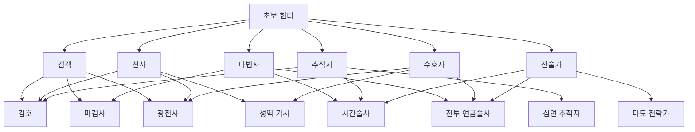

# Job System v2: RPG/웹툰 판타지 전직 시스템 디자인 명세서

본 문서는 LEVEL UP 프로젝트의 직업 시스템을 현실 자기관리 카테고리 자동 결정 방식에서 **사용자 주도의 RPG/웹툰 판타지 직업 시스템(v2)**으로 전환하고 이를 완성하기 위한 설계 및 2차 완성 패치 구현 내용을 기술합니다.

---

## 1. 기존 Job 시스템 감사 (Audit) 결과

### 1.1 기존 구조 및 문제점
- **자동 전직**: 현실 자기관리 활동(예: 운동 N회, 학습 N회) 조건 충족 시 특정 직업군으로 자동 매핑되어 전직이 강제되었습니다.
- **선택지 부족**: 1차에서 2차로 갈 때 계열별 선택지가 1개 내외로 부실하여 성장의 재미가 제한되었습니다.
- **경로 오염**: 1차 직업군과 무관하게 이전 직업 레벨만 충족되면 다른 계열의 2차/3차 직업들이 전직 후보로 개방되어 전직 계열이 뒤섞이는 버그가 있었습니다 (예: 마법사 1차 상태에서 검호 2차로 전직 가능).
- **히든 직업 구조 부실**: 히든 클래스가 평평하게 단일 등급으로 해금되어 1차/2차/3차 계열을 갖추지 못했습니다.

---

## 2. Job v2 핵심 철학 및 원칙

1. **RPG/웹툰 판타지 직업의 정체성**:
   - 직업은 독자적인 RPG 판타지 이름(예: 검객, 마검사, 시간술사, 그림자 군주 등)을 갖습니다.
2. **현실 자기관리는 성장 보조(Affinity) 요소**:
   - 현실 카테고리(운동, 공부 등)는 직업의 전직을 자동 결정하지 않습니다.
   - 단지 직업별 **친화 카테고리(Growth Affinity)**로만 매핑되어, 운동 퀘스트 완료 시 검객의 직업 XP가 가산되는 등의 성장 보조적 보너스만 제공합니다.
3. **사용자 직접 전직 (Manual Advancement)**:
   - 전직 조건을 만족하더라도 자동으로 전직되지 않고 **"전직 대기 후보"**로 활성화됩니다.
   - 플레이어가 직접 전직 수락 버튼을 눌러 선택해야만 전직이 완료됩니다.
4. **Active Job 중심의 XP 획득**:
   - 어떤 퀘스트(공부, 운동 등)든 완료하면 현재 활성화된 직업(`activeJob`)에 기본 직업 XP를 지급합니다.
   - 만약 완료한 퀘스트의 카테고리가 해당 직업의 친화 카테고리와 일치할 경우 **보너스 XP**를 획득합니다.

---

## 3. 일반 클래스 전직 트리 및 3개 선택지 보장 정책

각 단계(Tier) 전직 시 최소 3개 이상의 선택지를 노출하여 플레이어 선택의 폭을 넓히고, 계열 경로를 엄격하게 제한합니다.

### 3.1 2차 $\rightarrow$ 3차 고도화 매핑 (선택지 3개 보장)
각 2차 클래스는 해당 계열의 성격을 강화한 3차 최종 클래스 선택지를 최소 3개씩 가집니다.
- **검호 (`swordsmaster`)** $\rightarrow$ 검성 (`sword-saint`), 환영검사 (`illusory-swordmaster`), 질풍검제 (`speed-striker`)
- **마검사 (`spellsword`)** $\rightarrow$ 룬 마검사 (`rune-spellsword`), 심연마검사 (`abyss-spellsword`), 원소마검사 (`elemental-spellsword`)
- **광전사 (`berserker`)** $\rightarrow$ 용혈 기사 (`dragon-knight`), 불사전사 (`immortal-berserker`), 연옥학살자 (`hellfire-slayer`)
- **성역 기사 (`paladin`)** $\rightarrow$ 성역 수호자 (`divine-guardian`), 성스러운 구원자 (`holy-redeemer`), 심판의 성기사 (`judgment-knight`)
- **시간술사 (`chronomancer`)** $\rightarrow$ 시간의 관리자 (`time-governor`), 무한의 마도사 (`infinity-mage`), 엔트로피 조작자 (`entropy-manipulator`)
- **전투 연금술사 (`battle-alchemist`)** $\rightarrow$ 현자의 연금술사 (`sage-alchemist`), 엘릭서 창조자 (`elixir-creator`), 키메라 소환사 (`chimera-summoner`)
- **심연 추적자 (`abyss-stalker`)** $\rightarrow$ 심연검제 (`abyss-emperor`), 그림자 암살자 (`shadow-assassin`), 환영추적자 (`phantom-stalker`)
- **마도 전략가 (`grand-strategist`)** $\rightarrow$ 마도 전략가 상위직 (`grand-master-strategist`), 전쟁 조율사 (`war-orchestrator`), 운명 조율사 (`fate-weaver`)

---

## 4. 히든 직업 계열 구조 및 특수 기믹 해금 (12-34D 고도화)

히든 직업군은 일반 트리와 독립적으로 존재하며, 기존의 단순 1회성 단일 트리거 감지가 아닌 **"테마별 Hidden Resonance(공명) 점수 및 다중 신호 조합 누적"** 구조를 통해 고도의 희귀성을 띱니다.

### 4.1 히든 계열 트리 및 해금 요건
1. **그림자 계열 (branch: 'shadow')**:
   - `shadow-disciple` (1차): 그림자 공명 10 이상, 그림자 보유 1마리 이상, 그림자 추출 성공 경험, 그림자 원정 완료(성공/대성공) 경험 필요.
   - `shadow-commander` (2차): 그림자 공명 25 이상, `shadow-disciple` 레벨 10 이상, 그림자 보유 3마리 이상.
   - `shadow-lord` / `abyss-summoner` / `phantom-general` (3차): 그림자 공명 50 이상, `shadow-commander` 레벨 20 이상, 특정 신호(그림자 진화 등) 조합 필요.

2. **저주 계열 (branch: 'curse')**:
   - `curse-initiate` (1차): 저주 공명 12 이상, 헌터 레벨 15 이상, HP 15% 이하 긴박한 승리 1회 이상, 장기전(20턴 이상) 또는 보스전 긴박 승리 조합 필요.
   - `puppet-master` (2차): 저주 공명 25 이상, `curse-initiate` 레벨 10 이상, 게이트 클리어 15회 이상.
   - `soul-reaper` / `doom-herald` / `fate-breaker` (3차): 저주 공명 50 이상 (영혼 약탈자는 45), `puppet-master` 레벨 20 이상.

3. **차원 계열 (branch: 'chrono')**:
   - `rift-sensing-hunter` (1차): 차원 공명 12 이상, 헌터 레벨 15 이상, 장기전(20턴 이상) 승리 1회 이상, 무한의 탑 10층 클리어 또는 탑 보스 긴박 승리 조합 필요.
   - `dimension-traveler` (2차): 차원 공명 25 이상, `rift-sensing-hunter` 레벨 10 이상, 게이트 클리어 25회 이상.
   - `dimension-hunter` / `void-navigator` / `chrono-saber` (3차): 차원 공명 50 이상, `dimension-traveler` 레벨 20 이상.

### 4.2 신호별 공명(Resonance) 가중치 설계
- `shadow-extraction-attempt`: `shadow` +1
- `shadow-extract-success`: `shadow` +3
- `shadow-rare-acquired` / `shadow-named-acquired` / `shadow-evolved`: `shadow` +4 ~ +5
- `shadow-expedition-success` / `shadow-expedition-great`: `shadow` +2 ~ +4
- `low-hp-victory` / `low-hp-boss-victory`: `curse` +3 ~ +5
- `long-battle-victory`: `curse` +2, `rift` +2
- `tower-boss-clutch-victory` / `rift-special-victory`: `rift` +3 ~ +5

### 4.3 UI 힌트 동적 마스킹 및 스포일러 방지
플레이어의 공명 수준에 따라 미해금 히든 전직 후보의 마스킹 텍스트가 동적으로 변화합니다:
- **공명 0**: `???` 마스킹, "어둠 속에서 아무런 기척도 느껴지지 않습니다." (계열별 완전 침묵 힌트)
- **공명 50% 미만**: `???` 마스킹, "어둠이 당신의 그림자에 반응하고 있다." (일부 신호 감지 힌트)
- **공명 100% 미만**: `???` 마스킹, "한 계열의 기척이 뚜렷해지고 있다." (임박 힌트)
- **조건 충족**: 이름 복원(예: `어두운 그늘의 신도`), "히든 전직 후보의 기척이 활성화되었습니다. 다른 세부 조건을 충족하십시오."
정확한 요구 공명 수치 및 해금 조건 수식은 UI에 일절 노출하지 않아 신비감을 보존합니다.

---

## 5. UI/UX 및 저장 데이터 호환

1. **다음 전직 후보만 노출**:
   - 플레이어가 장착 중인 `activeJobId`의 `nextJobIds`에 연결되어 있는 다음 티어 전직 후보만 보여주며, 미달된 조건(헌터 레벨, 던전 클리어 횟수 등)을 명확하게 렌더링합니다.
   - 하단에 "클래스 도감"을 접힘 섹션으로 두어 전체 구조를 탐색할 수 있는 보조 기능만 제공합니다.
2. **로컬 세이브 및 Fallback 안정성**:
   - `levelup-save` 키와 로컬 스토리지의 `version: 14` 구조를 그대로 보존합니다.
   - V2 이전 또는 1차 구현 단계 세이브를 읽을 때 `activeJobId`가 유효하지 않으면 `'novice-hunter'`로 안전하게 복구합니다.

---

## 6. 직업별 핵심 스킬 및 패시브 목록 (1차 직업군)

| 직업 ID | 직업명 | 핵심 스킬 | 효과 | 실사용 역할 |
|---|---|---|---|---|
| `swordsman` | 검객 | 일섬 | 전방 단일 공격 (Power: 1.2, 쿨다운: 2턴) | 단일 물리 폭딜 / 치명타와 빠른 공격 템포 위주 |
| `warrior` | 전사 | 강습 | 전방 단일 큰 물리 타격 (Power: 1.3, 쿨다운: 3턴) | 높은 체력과 공격력의 밸런스 / 지속적인 생존전 |
| `mage` | 마법사 | 비전 폭발 | 광역 공격 (Power: 1.25, 쿨다운: 3턴) | 강력한 원거리 광역 피해 / 고지능 마법 타격 |
| `guardian` | 수호자 | 방패 전개 | 자신에게 데미지 감쇄 12% 버프 부여 (지속: 2턴, 쿨다운: 3턴) | 방어 및 아군 보호 / 극한의 생존력 확보 |
| `scout` | 추적자 | 암습 | 단일 은밀 공격 (Power: 1.35, 쿨다운: 3턴) | 민첩 및 치명타 위주 / 적의 사각 타격 및 고속 기동 |
| `tactician` | 전술가 | 약점 분석 | 적 전체의 방어력을 3턴간 10 감쇄시킵니다 (쿨다운: 4턴) | 디버프 / 아군 피해 지원 / 다이나믹한 유틸리티 쿨다운 운용 |

## 7. 최소 밸런스 감사 결과 (Simulation Output)

`lone_charger` (E급 단독 돌격병)와의 1:1 시뮬레이션 결과 (헌터 레벨 10, 기본 스탯 10, 직업 레벨 2 기준 50회 모의 실행):
- **초보 헌터 (Novice)**: 스킬 부재로 인해 4라운드에 걸친 장기전이 되어 몬스터에게 많이 피격당함. (평균 남은 체력 50.5%, 스킬 사용 0.00회)
- **검객 (Swordsman)**: '일섬' 스킬을 1회 사용하여 단 2라운드만에 제압. (평균 남은 체력 83.5%, 스킬 사용 1.00회)
- **전사 (Warrior)**: '강습' 스킬 및 우월한 체력/공격 밸런스로 최상의 안정성 입증. (평균 남은 체력 85.7%, 스킬 사용 1.00회)
- **마법사 (Mage)**: '비전 폭발' 마도 폭격을 통해 3라운드 제압. (평균 남은 체력 67.0%, 스킬 사용 1.00회)
- **수호자 (Guardian)**: '방패 전개' 피해 12% 감쇄 버프를 활용하여 4라운드간 안전하게 생존하며 제압. (평균 남은 체력 67.5%, 스킬 사용 1.00회)
- **추적자 (Scout)**: 민첩 기반 기동력으로 3라운드 제압. (평균 남은 체력 67.0%, 스킬 사용 1.00회)
- **전술가 (Tactician)**: '약점 분석' 방어력 감소 디버프 시너지를 2회 사용하여 단 2라운드만에 대단한 화력으로 제압. (평균 남은 체력 83.7%, 스킬 사용 2.00회)

*결론*: 각 직업 고유의 메커니즘(공격, 생존 버프, 디버프)이 정상적으로 런타임에 안착하였으며, 초보 헌터 대비 확연히 증가한 헌터 성능과 각 직업군별로 성격에 맞는 턴/생존 효율 차이가 통계적으로 잘 드러남을 확인하였습니다.
